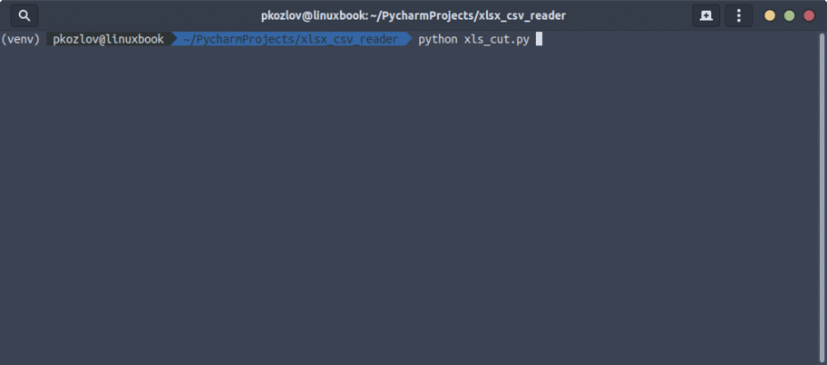

**xlsx_cut** - скрипт, модифицирующий Excel файл
## Применение
#### Дано
Есть Excel файл. Внутри файла, на одной из страниц есть колонка из произвольного числа строк (скрипт тестировался с 4700+ строками). Длинна текста в каждой ячейке в этой колонке неизвестна. (какие-то значения больше 30, какие-то меньше. Есть пустые значения).
#### Задача
Необходимо сделать так, что бы длинна текста в заданной ячейке не превышала 30 символов. При этом слова обрезать нельзя. Всё что свыше 30 символов, переносить в соседнюю ячейку. Пустые строки, и строки короче 30 символов оставлять как есть. (Число 30 - вязто из головы. Указать можно любое.)
## Описание
1. Скрипт при запуске спрашивает максимальную длинну строки.
2. Скрипт выводит на экран пронумерованный список файлов в текущей дирректории и просит выбрать файл (ввести цифру соответствующую файлу).
3. Скрипт выводит на экран пронумерованный список листов (страниц)  Excel в файле и просит выбрать необходимый лист (ввести цифру соответствующую листу).
4. Скрипт просит выбрать необходимую колонку (ввести цифру соответствующую колонке, где А  = 1, В = 2, С = 3 и так далее).
5. Скрипт создаёт в текущей папке файл с названием "***MODIFED_***" + название выбранного в ***пункте 2* **файла.
6. В созданном файле создаётся новый лист (страница) Excel, с названием выбранного в ***пункте 3* **листа.
7. В созданном листе, в первой ячейке (указанной в ***пункте 4***) пишется исходный текст (до указанного в ***пункте 1*** максимума), при этом слова не обрезаются. Если слово не влезает, оно переносится в другую ячейку. Во вторую ячейку (указанная в ***пункте 4*** +1)  пишется то, что не уместилось в первую. (Например, если в ***пункте 4*** выбрали ячейку В(2), то данные будут записаны в неё, а то, что не влезло в С(3))
## Установка:
1. Скачать себе на компьютер, разархивировать
2. Открыть в этой папке командную строку
3. Установить зависимости pip install -r requirements.txt
4. Запустить скрипт python xls_cut.py

ВАЖНО!!! Сам файл должен лежать в папке со скриптом!!!

------

